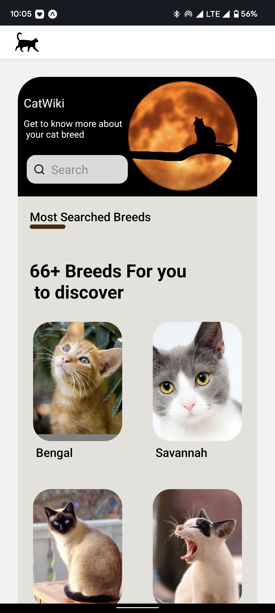
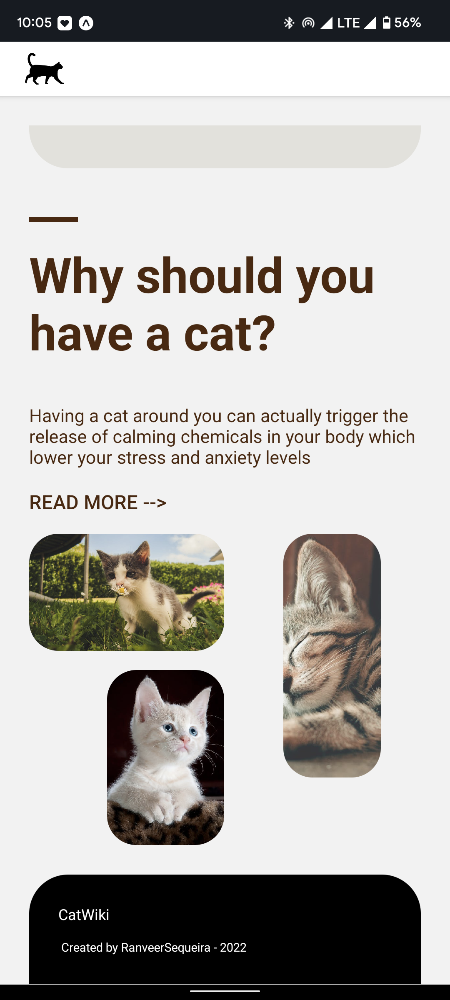
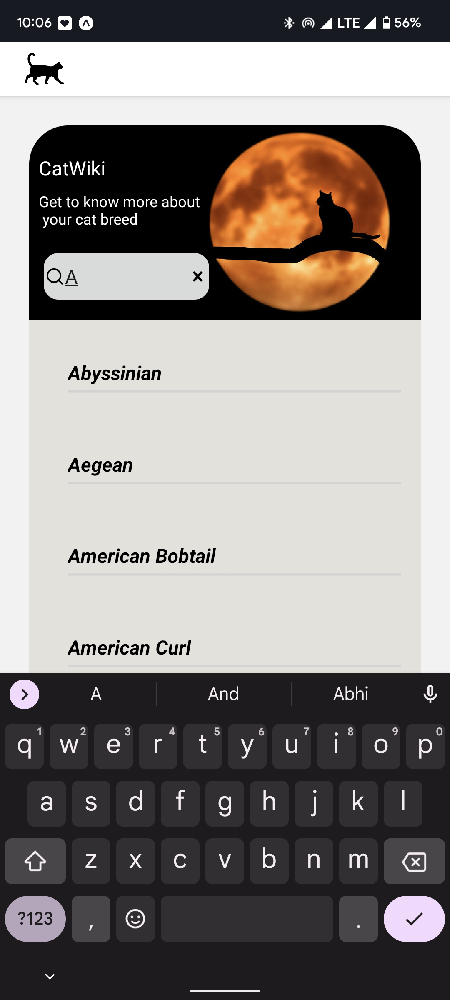
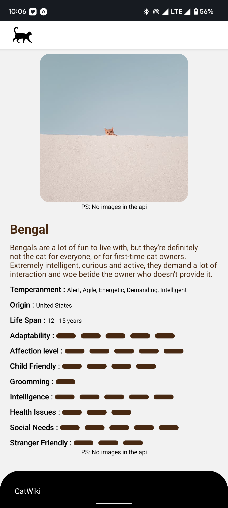

# catwiki

## You can download the android build - [App](https://drive.google.com/file/d/1dfhXqOfbs-OrMKTgKQIvAWfpzH9p-_bh/view?usp=sharing)

## Setup Instruction(Local)
1. Yarn and Nodejs must be installed
2. cd catwiki && yarn install
3. yarn web
4. You can scan the QR CODE via Expo app (Download it from play/appStore.)
5. Select and Run

### HomePage Top

### HomePage Bottom

### HomePage with Search

### Cat Detail Page

##For More images - [gdrive](https://drive.google.com/drive/folders/1APIYsIZTFpgG0RmC6EQrQqAPXwh8dljs?usp=sharing)
